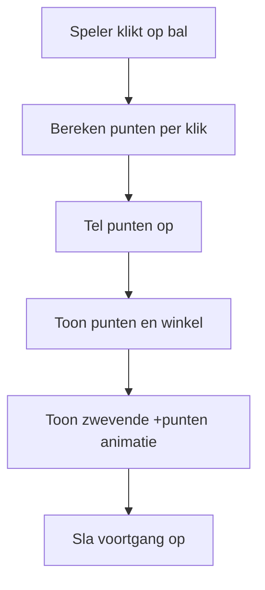
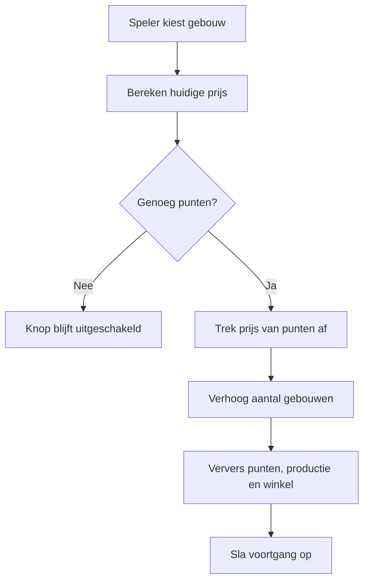
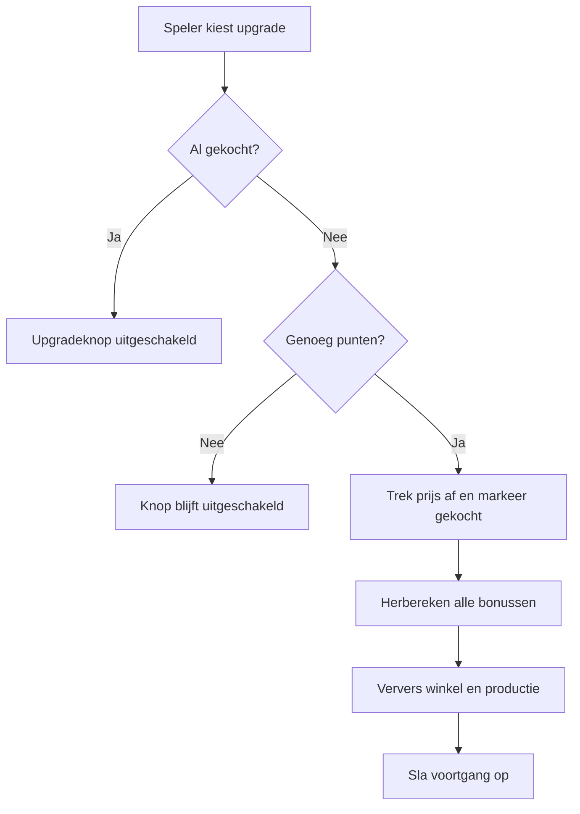
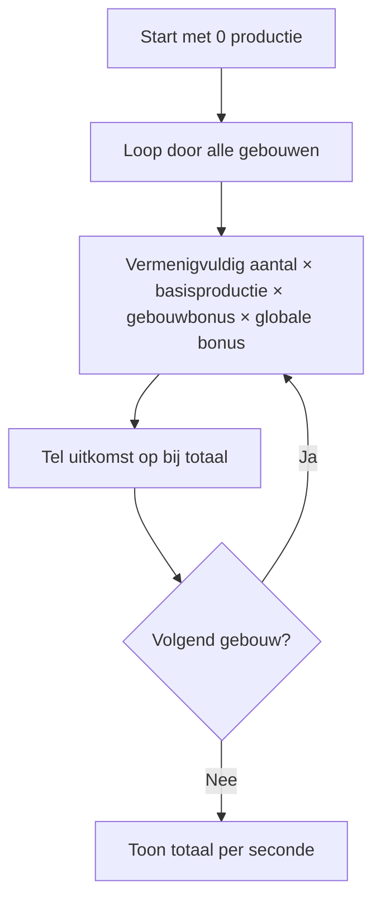

# Flowcharts — Ball Clicker

## Klik op de bal

```mermaid
flowchart TD
  A[Speler klikt op bal] --> B[Bereken punten per klik]
  B --> C[Tel punten op]
  C --> D[Toon punten en winkel]
  D --> E[Toon zwevende +punten animatie]
  E --> F[Sla voortgang op]
```

## Productie-eenheid kopen

```mermaid
flowchart TD
  A[Speler kiest gebouw] --> B[Bereken huidige prijs]
  B --> C{Genoeg punten?}
  C -- Nee --> D[Knop blijft uitgeschakeld]
  C -- Ja --> E[Trek prijs van punten af]
  E --> F[Verhoog aantal gebouwen]
  F --> G[Ververs punten, productie en winkel]
  G --> H[Sla voortgang op]
```

## Upgrade kopen

```mermaid
flowchart TD
  A[Speler kiest upgrade] --> B{Al gekocht?}
  B -- Ja --> C[Upgradeknop uitgeschakeld]
  B -- Nee --> D{Genoeg punten?}
  D -- Nee --> E[Knop blijft uitgeschakeld]
  D -- Ja --> F[Trek prijs af en markeer gekocht]
  F --> G[Herbereken alle bonussen]
  G --> H[Ververs winkel en productie]
  H --> I[Sla voortgang op]
```

## Punten per seconde berekenen

```mermaid
flowchart TD
  A[Start met 0 productie] --> B[Loop door alle gebouwen]
  B --> C[Vermenigvuldig aantal × basisproductie × gebouwbonus × globale bonus]
  C --> D[Tel uitkomst op bij totaal]
  D --> E{Volgend gebouw?}
  E -- Ja --> C
  E -- Nee --> F[Toon totaal per seconde]
```
